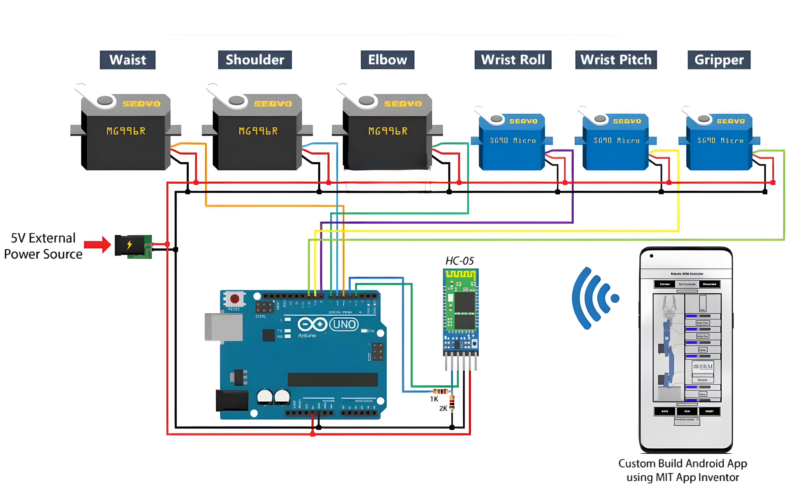
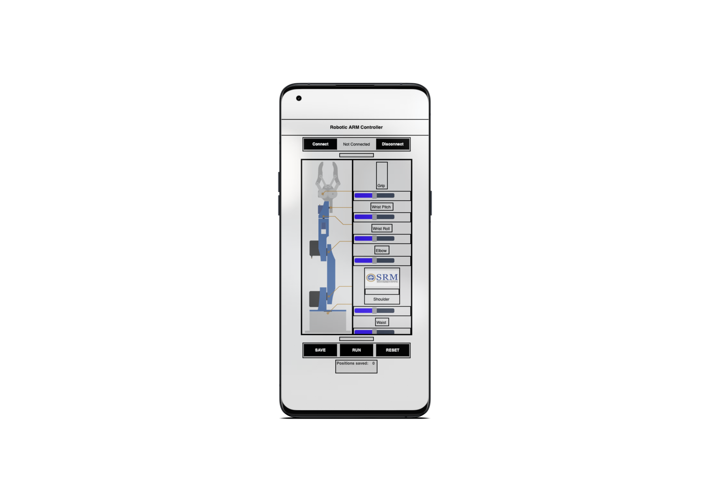

# Robotic ARM (Mini Project)

This Robotic ARM is built using a 3D Printer, this robotic arm is controlled using a mobile app built on [MIT App Inventor](http://ai2.appinventor.mit.edu/).
This project was built for our Semiconductor Mini Project.

## Components & Cost

`Total Cost = ~ ₹3,428`

- 1 x Arduino Uno (1 x ₹779)
- 1 x HC-05 Bluetooth Module (1 x ₹335)
- 3 x SG90 Servo Motors (3 x ₹164)
- 3 x MG996R Servo Motors (3 x ₹459)
- 1 x Breadboard (1 x ₹92)
- Jumper Cables (1 x ₹106)
- 1.75mm PLA Filament (1 x 1200)*
- 3D Printed Parts (₹1.2 x 206)

> Note: *PLA Filament was already available with us, so we didn't have to buy it.

## Circuit Diagram

## App

App was built using [MIT App Inventor](http://ai2.appinventor.mit.edu/).

## License

This project is licensed under the MIT License - see the [LICENSE](LICENSE) file for details.

## Credits

- [Arduino UNO](https://www.amazon.in/gp/product/B0BRQRMN2W/ref=ppx_yo_dt_b_asin_title_o06_s00?ie=UTF8&psc=1)
- [MIT App Inventor](http://ai2.appinventor.mit.edu/)
- [SG90 Servo Motor](https://www.amazon.in/gp/product/B07LD9K52Y/ref=ppx_yo_dt_b_asin_title_o05_s01?ie=UTF8&psc=1)
- [MG996R Servo Motor](https://www.amazon.in/gp/product/B08THD5DVS/ref=ppx_yo_dt_b_asin_title_o05_s00?ie=UTF8&psc=1)
- [HC-05 Bluetooth Module](https://www.amazon.in/gp/product/B087C39X6D/ref=ppx_yo_dt_b_asin_title_o07_s00?ie=UTF8&psc=1)
- [Breaboard](https://www.amazon.in/gp/product/B00MC1CCZQ/ref=ppx_yo_dt_b_asin_title_o08_s00?ie=UTF8&psc=1)
- [Jumper Cables](https://www.amazon.in/gp/product/B074JB6SX8/ref=ppx_yo_dt_b_asin_title_o08_s00?ie=UTF8&psc=1)
- [PLA Filament](https://robu.in/product/esun-pla-1-75mm-3d-printing-filament-1kg-silver/)
- [3D Printed Parts](https://howtomechatronics.com/tutorials/arduino/diy-arduino-robot-arm-with-smartphone-control/)

## Authors

- Rohit Kumar | RA2311003011411
- Rishika Raj | RA2311003011412
- Lakshay Sharma | RA2311003011413
- Vinuthan MH | RA2311003011414
- Abhigyan Shukla | RA2311003011415
- Govind Jee | RA2311003011416
- [Mantresh Kumar | RA2311003011417](https://github.com/mantreshkhurana)
- Muthyala Ashwartha Kumar | RA2311003011418
